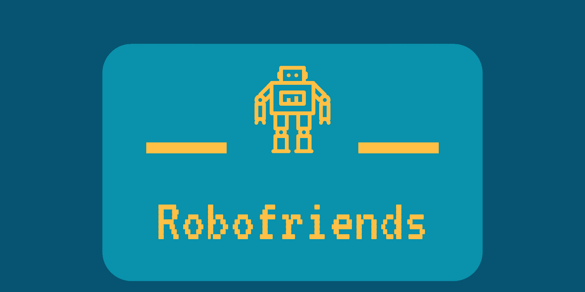

# JavaScript-projects
<strong>My index repository for all my javascript projects</strong>

## Blogfolio:
<strong>My Blogfolio website</strong>

[Live Website](https://aswinbarath.github.io/) 
[GitHub Repo][1]

   

## Robofriends App:
<strong>A fun little react app</strong>

[Live Website](https://aswinbarath.github.io/robofriends/) 
[GitHub Repo][2]

   

## SQL injection and Prevention project:
<strong>Demonstrates SQL injection attacks using malicious SQL queries and SQL prevention techniques.</strong>

[Live Website](https://sql-injection-and-prevention.herokuapp.com/) 
[GitHub Repo][3]

   

## Cool Cursor project
<strong>A really cool cursor website made with canvas in javascript</strong>

[Live Website](https://aswinbarath.github.io/Cool-cursor/) 
[GitHub Repo][4]

   

## Calender project:
<strong>A dynamic calender implemented using jQuery</strong>

[Live Website](https://aswinbarath.github.io/calendar-project/) 
[GitHub Repo][5]

   

[1]: https://github.com/AswinBarath/aswinbarath.github.io
[2]: https://github.com/AswinBarath/robofriends
[3]: https://github.com/AswinBarath/sql-injection-and-prevention
[4]: https://github.com/AswinBarath/Cool-cursor
[5]: https://github.com/AswinBarath/calendar-project

